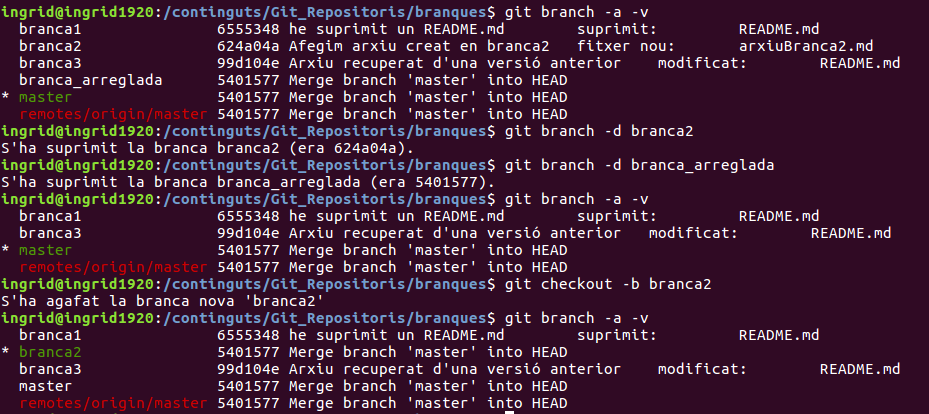

# GIT APUNTS DE WEBINARDS


## EINES

DESENVOLUPAMENT - **JIRA**, **Git**

AUTOMATITZACIÓ TASQUES DE DESENVOLUPAMENT - **Jenkins**, **Bamboo**

AUTOMATITZACIÓ TASQUES DE DESPLEGAMENT - **Ansible**, **Puppet**, **CHEF**, **docker**, **Nexus**

**SVN** antiga eina de control, subversion (nom complet) amb un repositori central però sense repositoris alternatius i en local.

OBSERVACIÓ DE CANVIS - **tkdiff** senzilla, visual i multiplataforma

> Cal montar un servidor de Git bàsic. Accesible des del protocol SSH. Amb soft instal·lat i només cal tenir executar:
>
> ```
> git init
> ```
>
> Al directori de treball. Per esborrar-lo:
>
> ```
>rm -rf .git
> ```
> 
> 

## CONCEPTES BÀSICS

- És un sistema distribuït de control de versions, no com controladors centralitzats anteriors (SVN), on només accedia un desenvolupador.

- Molt potent
- No depen d'un repositori central
- És software lliure
- Disposem d'un historial de revisions complert
- Es pot treballar amb branques diferents de codi (*branches*) i funcions (*merge*) de branques de codi és un procés àgil.

**Altres DVCS com Git són: *Mercurial*, *Bazaar*, *Darcs* ** Control de Versions Distribuïts.

Els clients repliquen completament el repositori.

Per contra, en els sistemes centralitzats, no es repliquen tot l'historic i les modificacions fetes en cada repositori són **deltas** . 

En els distribuïts, s'enmagatzemen només versions completes dels canvis i les versions en procés mantenen apuntadors a les versions completes, que sempre estan actualitzades a tots els repositoris.

### ESTATS D'UN ARXIU GIT

3 estats:

- **Confirmat** - commited, ja modificats i confirmats com a completats. 
- **Modificat** - untracket, on s'estan treballant però encara no estan acabats.
- **Preparat** - staged, s'emagatzemen els arxius fins completar la part de codi que volem deixar completada, fins la confirmació.

El **working directory** és el nostre directori de treball, on tindrem el codi que estem modificant.

L'**Staging Area**, s'acumulen tots els arxius que creguem necessaris per poder realitzar una foto de la versió.

Quan tots aquests arxius estiguin complerts els pujarem al **repository**.

> En resum, Git ens permet continuar treballant en el nostre codi, conjuntament amb altres colaboradors, encara que perdem la connexió de xarxa.

### EINES DE TREBALL AMB GIT

Descarregar Git.

Tkdiff, compara dos arxius. En un mostra totes les les diferencies, amb diferents colors segons el seu origing. **En Linux ve per defecte vimdiff**.

Editors, per defecte tenim **Vim** o també es pot fer servir **nano**.

**Githum** per guardar contrasenyes. En Windows en l'arxiu *credential.helper*, des del panell de control.


### PARAMETRITZACIÓ INICIAL GIT A WINDOWS*

```
git config --global user.name "nom"
git config --global user.email direccio@domini.com
git config --global diff.tool tkdiff
git config --global credential.helper manager
git config --global core.editor nano
```

Eines per treballar amb mode gràfic: **SourceTree** o **GitKraken** si no es vol treballar per terminal

## CREACIÓ I ESTAT D'UN PROJECTE

Ens anem al directori arrel dels nostres projectes i creem un nou directori de projecte i iniciarem el repositori:

```
mkdir /continguts/GIT_REPOSITORI_LOCAL/escenario1
cd /continguts/GIT_REPOSITORI_LOCAL/escenario1
git init

```

comprovem que tenim l'extructura creada encara que estigui oculta:

```
$ ls -lart .git
total 2
drwxrwxrwx 1 root root 144 oct 21 17:04 ..
drwxrwxrwx 1 root root 240 oct 21 17:04 refs
drwxrwxrwx 1 root root 528 oct 21 17:04 hooks
drwxrwxrwx 1 root root   0 oct 21 17:04 branches
drwxrwxrwx 1 root root 144 oct 21 17:04 info
-rwxrwxrwx 1 root root  73 oct 21 17:04 description
-rwxrwxrwx 1 root root  23 oct 21 17:04 HEAD
-rwxrwxrwx 1 root root  93 oct 21 17:04 config
drwxrwxrwx 1 root root 440 oct 21 17:04 .
drwxrwxrwx 1 root root 240 oct 21 17:04 objects

```

Creem un arxiu en markdown d'exemple i comprovem el seu estatus:

```
echo "# PRIMERA LINIA D'UN ARXIU README.md" > README.md
git status
```

> En la branca master
>
> Comissió inicial
>
> Fitxers no seguits:
>        (useu "git add <fitxer>..." per a incloure-ho en què es cometrà)
>
> ​		**<span style="color:darkred">README.md</span>**
>
> no hi ha res afegit a cometre però fitxers no seguits estan presents (useu "git add" per a seguir-los)

Per passar-lo a estat de **preparat** :

```
git add README.md
git status
```

> En la branca master
>
> Comissió inicial
>
> Canvis a cometre:
>      (useu "git rm --cached <fitxer>..." per a desallistar)
>
> ​      **<span style="color:darkgreen"> fitxer nou:         README.md</span>**

Per **confirmar-lo**:

```
git commit -m "Missatge del primer commit"
```

Com que és el primer que hem fet i ens falta establir les credencials ens demanarà:

>[master (comissió d'arrel) <span style="color:yellow">113b0f7</span>] missatge del primer commit
> 1 file changed, 1 insertion(+)
> create mode 100644 README.md

Els hi establirem i després tornarem a donar l'ordre. Després, ja no caldrà tornar a establir les credencials:

```
git config --global user.email "ingriddeveloper@gmail.com"
git config --global user.name "ingrid"
git commit -m "Missatge del primer commit"		
```

>En la branca master
>no hi ha res a cometre, directori de treball net

Per veure les **revisions**:

```
git log --oneline
```

Ens retornarà un hash id (identificador de versió):

> 113b0f7 missatge del primer commit

---

### Treballant amb revisions

Farem una nova revisió creant uns arxius d'exemples:

```
echo "fichero 1 " > ficch1.tmp
echo "fichero 1 " > ficch2.tmp
echo "fichero 1 " > ficch3.tmp
echo "fichero 1 " > ficch4.tmp
```

Amb **git status** comprovem que encara estan en desenvolupament, en vermell.

**<span style="color:pink">Podem crear màsqueres p.ex:</span>**

```
vi .gitignore
```

> *.tmp

Aquesta màscara és perquè ignori els arxius amb aquesta extensió.

Afegim tots els arxius a **staged**:

```
git add .git
```

Afegeix tots els arxius, menys les extensions contingudes dins de l'arxiu **.gitignore** que és un arxiu de màscares:

```
git add .gitignore
```

> Ex. de màscara: 		***.tmp**

Per forçar la pujada d'un arxiu amb una de les màscares d'exclusió:

```
git add -f arxiuAmbExtensioExclosa
```


**Ara afegim la nova versió**:

```
git commit -m "revisó 2 amb el .gitignore"	
```

>[master <span style="color:yellow">ef559e8</span>] revisió 2 amb el .gitignore
> 1 file changed, 1 insertion(+)
> create mode 100644 .gitignore

**Comprovem les versions**:

```
git log --oneline	
```

><span style="color:yellow">ef559e8</span> revisió 2 amb el .gitignore
><span style="color:yellow">113b0f7</span> missatge del primer commit

*Els fitxers amb l'extensió exclosa mai aniran a dins de cap revisió.*

---

### GIT STATUS

Entenem com directori de treball net aquell que ja no té cap arxiu per passar a la foto final de la revisió.

Recordem que sempre hi ha 3 estats: working, prepared i commit. Els dos últims permeten recuperar arxius. El primer, si l'esborrem, el perdem totalment.

Si modifiquem un arxiu que ja ha passat a la versió, ens torna a constar, a l'estatus, com arxiu al working.

Si a més, en creem un nou arxiu i fem l'estatus, comprovarem que git ens adverteix que **dos arxius són al working** i que **un d'ells és nou**:

>En la branca master
>Canvis no allistats per a cometre:
>  (useu "git add <fitxer>..." per a actualitzar què es cometrà)
>  (useu "git checkout -- <fitxer>..." per a descartar els canvis en el directori de treball)						<span style="color:red">modificat:        README.md</span>
>
>Fitxers no seguits:
>  (useu "git add <fitxer>..." per a incloure-ho en què es cometrà)
>
>​						<span style="color:red">readme2.md</span>
>
>no hi ha canvis afegits a cometre (useu "git add" o "git commit -a")

---

## GIT DIFF

Si tornem a modificar un dels arxius del commit, en l'estatus tornarà a estar al **working**, i també podrem comprovar si hi ha diferències respecte a les versions guardades amb **commit**:

```
git diff
```

>**diff --git a/README.md b/README.md
>index cba05ea..be2647a 100644
>--- a/README.md
>+++ b/README.md**
><span style="color:turquoise">@@ -1 +1 @@</span>
><span style="color:red">-# 2ªMODIFICACIÓ -  PRIMERA LINIA D'UN ARXIU README.md</span>
><span style="color:green">+# ** `<span style="color:orange">2ªMODIFICACIÓ</span>` -  PRIMERA LINIA D'UN ARXIU README.md</span>**

Per veure els canvis d'una manera més visual:

```
git difftool
```

Si no ho tenim configurat configurat vimdiff:

```
git config --global diff.tool vimdiff
git difftool
```

Ens mostrarà el Vim dividit amb dos documents.

Podem utilitzar unes eines més visuals, com per exemple el **tkdiff** comenta anteriorment.

Si volem comprovar els canvis entre **staged** i **commit** d'un arxiu, la comanda serà:

```
git diff --staged
```

Per veure els canvis entre **staged** i **working** :

```
git diff --cached
```

---

## ESBORRAR i RENOMBRAR D'ARXIUS

Per poder fer un bon segiment, les comandes **rm** i **mv** s'han d'executar des de **git** ja que aleshores ens fa l'històric real del què ha passat amb aquest arxius. Si ho fem directament perdrem informació:

```
git rm arxiuAEsborrar
git mv nomOriginalArxiu nouNomArxiu
```

---

## COMANDA LOG

**Git log ens mostra informació de les revisions. També ho podem mostrar amb diferents formats**.

format bàsic d'una línia:

```
git log --oneline
```

> <span style="color:yellow">dd60395</span> revisió 5
<span style="color:yellow">e508d93 </span>revisió 4
<span style="color:yellow">4c51f56 </span>revision 3
<span style="color:yellow">ef559e8</span> revisió 2 amb el .gitignore
<span style="color:yellow">113b0f7</span> missatge del primer commit

format  --pretty (màscara de formatació) amb  h (hash id) , an (autor name), ar (author revision), s ( revision name) :

```
git log --pretty="%h %an %ar %s"
```

>dd60395 ingrid fa 12 hores revisió 5
>e508d93 ingrid fa 12 hores revisió 4
>4c51f56 ingrid fa 13 hores revision 3
>ef559e8 ingrid fa 13 hores revisió 2 amb el .gitignore
>113b0f7 heliagat 1920 fa 18 hores missatge del primer commit

Per mostrar més informació entre totes les versions:

```
git log -p
```

>commit 44c4f0dccc7b0ad664e7a7b3a80dfa5325665f25
>Author: Ingrid <ingriddeveloper@gmail.com>
>Date:   Wed Oct 23 17:15:41 2019 +0200
>
>    nou
>
>diff --git a/tercerArxiu.md b/tercerArxiu.md
>index 44d4fff..1d5f2d5 100644
>--- a/tercerArxiu.md
>+++ b/tercerArxiu.md
>@@ -1 +1,3 @@
> un tercer arxiu nou
>+segon error
>+## tercerArxiu.md
>
>commit b5924d5efd1007bbd0a3033e150a4297609e7a0b
>Author: Ingrid <ingriddeveloper@gmail.com>
>Date:   Wed Oct 23 17:07:20 2019 +0200
>
>    commit del tercer arxiu
>
>diff --git a/tercerArxiu.md b/tercerArxiu.md
>new file mode 100644
>
>...

Per mostrar entre dos versións:

```
git log -p -n -2
```

Per mostrar les diferències  en un periode de temps:

```
git log  -- since="s weeks ago" --until="2 days ago"				
```

---

## GIT SHOW

Mostrar tota la informació d'una revisió en concret amb el seu hash id:

``` 
git show dd60395
```

> Author: ingrid `<ingriddeveloper@gmail.com>`
> Date:   Tue Oct 22 00:52:12 2019 +0200
>
> ​     revisió 5
>
> diff --git a/readme2.md b/readme2.md
> deleted file mode 100644
> index 2308fb9..0000000
> --- a/readme2.md
> +++ /dev/null
> <span style="color:turquoise">@@ -1 +0,0 @@</span>
> <span style="color:red">-nou arxiu</span>
> diff --git a/readme3.md b/readme3.md
> new file mode 100644
> index 0000000..2308fb9
> --- /dev/null
> +++ b/readme3.md
> <span style="color:turquoise">@@ -0,0 +1 @@</span>
> **<span style="color:green">+nou arxiu</span>**

---

## CLONAR REPOSITORIS EXTERNS

### git remote add origin ... <span style="color:red">,</span>   git fetch origin   <span style="color:red">,</span>  git pull origin master

Primer l'hi haurem de crear el seu entorn, amb una carpeta i la seva parametrització global.

**origin** és el nom que donem nosaltres, per convenció, per indicar que és el repositori d'origen. Per clonar-ho d'un repositori remot, primer l'hi indicarem la ruta:

```
git remote add origin https://github.com/sharkdp/bat
```

Després li donarem l'ordre de recuperar la informació sobre el seu contingut amb **fetch**:

```
git fetch origin
```

Aleshores ens informarà de tot el què conté el repositori:

>remote: Enumerating objects: 19, done.
>remote: Counting objects: 100% (19/19), done.
>remote: Compressing objects: 100% (15/15), done.
>Rebent objectes:  23% (851/3699), 508.01 KiB | Rebent objectes:  24% (888/3699), 508.01 KiB | Rebent objectes:  25% (925/3699), 508.01 KiB | Rebent objectes:  26% (962/3699), 508.01 KiB | Rebent objectes:  27% (999/3699), 508.01 KiB | Rebent objectes:  28% (1036/3699), 508.01 KiB |Rebent objectes:  29% (1073/3699), 508.01 KiB |Rebent objectes:  30% (1110/3699), 508.01 KiB |Rebent objectes:  31% (1147/3699), 508.01 KiB |Rebent objectes:  32% (1184/3699), 508.01 KiB |Rebent objectes:  32% (1199/3699), 1.25 MiB | 1Rebent objectes:  33% (1221/3699), 2.09 MiB | 1Rebent objectes:  34% (1258/3699), 2.09 MiB | 1Rebent objectes:  35% (1295/3699), 2.09 MiB | 1Rebent objectes:  36% (1332/3699), 2.09 MiB | 1Rebent objectes:  37% (1369/3699), 2.09 MiB | 1Rebent objectes:  38% (1406/3699), 2.09 MiB | 1Rebent objectes:  38% (1442/3699), 3.00 MiB | 1Rebent objectes:  39% (1443/3699), 3.00 MiB | 1Rebent objectes:  40% (1480/3699), 3.00 MiB | 1Rebent objectes:  41% (1517/3699), 3.00 MiB | 1Rebent objectes:  42% (1554/3699), 3.00 MiB | 1Rebent objectes:  43% (1591/3699), 3.00 MiB | 1Rebent objectes:  44% (1628/3699), 3.00 MiB | 1Rebent objectes:  45% (1665/3699), 3.00 MiB | 1Rebent objectes:  46% (1702/3699), 3.78 MiB | 1Rebent objectes:  47% (1739/3699), 3.78 MiB | 1Rebent objectes:  48% (1776/3699), 3.78 MiB | 1Rebent objectes:  49% (1813/3699), 3.78 MiB | 1Rebent objectes:  50% (1850/3699), 3.78 MiB | 1Rebent objectes:  51% (1887/3699), 3.78 MiB | 1Rebent objectes:  52% (1924/3699), 3.78 MiB | 1Rebent objectes:  52% (1941/3699), 4.62 MiB | 1Rebent objectes:  53% (1961/3699), 4.62 MiB | 1Rebent objectes:  54% (1998/3699), 5.54 MiB | 1Rebent objectes:  55% (2035/3699), 5.54 MiB | 1Rebent objectes:  56% (2072/3699), 5.54 MiB | 1Rebent objectes:  57% (2109/3699), 5.54 MiB | 1Rebent objectes:  58% (2146/3699), 5.54 MiB | 1Rebent objectes:  59% (2183/3699), 5.54 MiB | 1Rebent objectes:  60% (2220/3699), 5.54 MiB | 1Rebent objectes:  61% (2257/3699), 5.54 MiB | 1Rebent objectes:  62% (2294/3699), 5.54 MiB | 1Rebent objectes:  63% (2331/3699), 5.54 MiB | 1Rebent objectes:  63% (2367/3699), 6.50 MiB | 1Rebent objectes:  64% (2368/3699), 6.50 MiB | 1Rebent objectes:  65% (2405/3699), 6.50 MiB | 1Rebent objectes:  66% (2442/3699), 6.50 MiB | 1Rebent objectes:  67% (2479/3699), 6.50 MiB | 1Rebent objectes:  68% (2516/3699), 6.50 MiB | 1Rebent objectes:  69% (2553/3699), 7.51 MiB | 1Rebent objectes:  70% (2590/3699), 7.51 MiB | 1Rebent objectes:  71% (2627/3699), 7.51 MiB | 1Rebent objectes:  72% (2664/3699), 7.51 MiB | 1Rebent objectes:  73% (2701/3699), 7.51 MiB | 1Rebent objectes:  74% (2738/3699), 7.51 MiB | 1Rebent objectes:  75% (2775/3699), 7.51 MiB | 1Rebent objectes:  76% (2812/3699), 7.51 MiB | 1Rebent objectes:  76% (2825/3699), 7.99 MiB | 1Rebent objectes:  77% (2849/3699), 7.99 MiB | 1Rebent objectes:  78% (2886/3699), 7.99 MiB | 1Rebent objectes:  79% (2923/3699), 7.99 MiB | 1Rebent objectes:  80% (2960/3699), 7.99 MiB | 1Rebent objectes:  81% (2997/3699), 7.99 MiB | 1Rebent objectes:  82% (3034/3699), 7.99 MiB | 1Rebent objectes:  83% (3071/3699), 9.35 MiB | 1Rebent objectes:  84% (3108/3699), 9.35 MiB | 1Rebent objectes:  85% (3145/3699), 9.35 MiB | 1Rebent objectes:  86% (3182/3699), 9.35 MiB | 1Rebent objectes:  87% (3219/3699), 9.35 MiB | 1Rebent objectes:  87% (3235/3699), 9.35 MiB | 1Rebent objectes:  88% (3256/3699), 10.32 MiB | Rebent objectes:  89% (3293/3699), 10.32 MiB | Rebent objectes:  90% (3330/3699), 10.32 MiB | Rebent objectes:  91% (3367/3699), 10.32 MiB | Rebent objectes:  92% (3404/3699), 10.32 MiB | Rebent objectes:  93% (3441/3699), 10.32 MiB | Rebent objectes:  94% (3478/3699), 10.32 MiB | Rebent objectes:  95% (3515/3699), 10.32 MiB | Rebent objectes:  96% (3552/3699), 10.32 MiB | Rebent objectes:  97% (3589/3699), 11.19 MiB | Rebent objectes:  98% (3626/3699), 11.19 MiB | remote: Total 3699 (delta 5), reused 13 (delta 3), pack-reused 3680
>Rebent objectes:  99% (3663/3699), 11.19 MiB | Rebent objectes: 100% (3699/3699), 11.19 MiB | Rebent objectes: 100% (3699/3699), 11.26 MiB | 1.83 MiB/s, fet.
>Resolent les deltes: 100% (2487/2487), fet.
>De https://github.com/sharkdp/bat
>
> * [branca nova]     bat-diff   -> origin/bat-diff
> * [branca nova]     ci-experiment -> origin/ci-experiment
> * [branca nova]     fix-666    -> origin/fix-666
> * [branca nova]     highlight-line -> origin/highlight-line
> * [branca nova]     library-updates -> origin/library-updates
> * [branca nova]     master     -> origin/master
> * [branca nova]     re-enable-aarch64 -> origin/re-enable-aarch64
> * [etiqueta nova]   v0.1.0     -> v0.1.0
> * [etiqueta nova]   v0.10.0    -> v0.10.0
> * [etiqueta nova]   v0.11.0    -> v0.11.0
> * [etiqueta nova]   v0.12.0    -> v0.12.0
> * [etiqueta nova]   v0.12.1    -> v0.12.1
> * [etiqueta nova]   v0.2.0     -> v0.2.0
> * [etiqueta nova]   v0.2.1     -> v0.2.1
> * [etiqueta nova]   v0.2.2     -> v0.2.2
> * [etiqueta nova]   v0.2.3     -> v0.2.3
> * [etiqueta nova]   v0.3.0     -> v0.3.0
> * [etiqueta nova]   v0.4.0     -> v0.4.0
> * [etiqueta nova]   v0.4.1     -> v0.4.1
> * [etiqueta nova]   v0.5.0     -> v0.5.0
> * [etiqueta nova]   v0.6.0     -> v0.6.0
> * [etiqueta nova]   v0.6.1     -> v0.6.1
> * [etiqueta nova]   v0.7.0     -> v0.7.0
> * [etiqueta nova]   v0.7.1     -> v0.7.1
> * [etiqueta nova]   v0.8.0     -> v0.8.0
> * [etiqueta nova]   v0.9.0     -> v0.9.0

Hi comprovem que hi existeixen 7 branques i unes 19 etiquetes de versió.

La *branca principal* per convenció és la **master**.

**Per comprovar les branques del repositori amb les que estem enllaçats**:

```
git branch -v -a
```

> **<span style="color:red">remotes/origin/bat-diff</span>**          cd501ed Initial experiment on 'bat diff'
>**<span style="color:red">remotes/origin/ci-experiment</span>**     0dc9a40 CI experiment
>**<span style="color:red">remotes/origin/fix-666</span>**           f5d3599 Fix 'bat cache other-arg', closes #666
>**<span style="color:red">remotes/origin/highlight-line</span>**    561813e Initial work on highlight-line
>**<span style="color:red">remotes/origin/library-updates</span>**   153faca Make a few modules private
>**<span style="color:red">remotes/origin/master</span>**            4664fb6 Remove comment in both examples
>**<span style="color:red">remotes/origin/re-enable-aarch64</span>** 01db679 Add libc6-dev dependency for aarch64

Per **descarregar-ho** farem:

```
git pull origin master	
```

Amb això, el contingut es posarà dins del **nostre master**

>De `https://github.com/sharkdp/bat`
>
> `*` branch            master     -> FETCH_HEAD

Si en comptes de fer-ho així, ho fem des del botó de la pàgina. Les comandes: **git init**,**git fetch** i **git pull** es fan de cop implícitament.

Per clonar un repositori com per exemple els que podem trobar a **github** podem fer-ho des del propi repositori, amb el botó de **<span style="color:lightgreen">clonar o baixar repositori</span>**:


---

## GIT CLONE

Aquesta comanda **fa les tres passes anteriors de forma implícita**. Amb el punt final per descarregar-ho on estem:

```
git clone https://github.com/heliagat/nomProjecte .
```

>Clonant a 'ej06-branches'...
>remote: Enumerating objects: 6, done.
>remote: Counting objects: 100% (6/6), done.
>remote: Compressing objects: 100% (2/2), done.
>remote: Total 6 (delta 0), reused 0 (delta 0), pack-reused 0
>Desempaquetant objectes: 100% (6/6), fet.
>Provant connectivitat... fet.

---

## GIT PUSH ORIGIN MASTER

Per pujar els nostres arxius al repositori. Ens demanarà les credencials per poder accedir al repositori.

---

## GIT CHECKOUT

Aquesta comanda reposa tot el **working directory** a l'última versió aprovada **commited**.

> * **git checkout .** reposa tots els arxius
>
> * **git checkout  nomBranca** reposa una de les branques del projecte
>
> * **git checkout -- nomArxiu** reposa un arxiu o directori
>
> * **git checkout numRevisio arxiu** reposa un arxiu d'una revisió concreta
>
> * **git checkout -- .** recupera tot
>
> * **git checkout HEAD -- .** reposa la última revisió
>
>   

---

## GIT RESET - Recuperació d'àrea d'staging

Aquesta comanda ens pot ajudar a reposar arxius de l'àrea **staged** a l'àrea **working**.

> **<span style="background-color:black">Cal recordar, que si borrem algun arxiu de l'àrea de working, ja no és recuperable. </span>** Només serien recuperables versions des de **commit** o **stage** però no el què hem esborrat.

<span style="background-color:red;color:green">**git reset --hard** és una comanda que importa des de l'àrea de **commit** al **working**, i elimina tant arxius de l'**stage**</span>.

>**git reset --hard HEAD~1** eliminarà la última versió en **commit**

Cal recordar que git sempre ens informa de creacions o modificacions. Si importem una versió **commit** no ens apareixerà res a estatus perquè ni ha estat creada de nou ni ha estat modificada, només ha estat recuperada.

Si volem eliminar algún arxiu de l'staging farem servir:

```
git reset HEAD arxiu
```

---

## GIT REVERT

**git revert numVersio**

Fa reversions o revertir canvis dins d'una franja donada:

**git revert HEAD...HEAD~2 --no-edit** - reverteix tots el canvis des de HEAD fins a HEAD menys dos. El *--no-edit* és perquè no pregunti quins canvis es volen aplicar (s'indica amb unes 'almoadilles' que quan es treuen s'aplica el canvi i per tant podem saltar canvis en arxius que no volguem canviar), sinó que els efectui directament.

És més fi que **RESET** perquè ens permet escullir quins canvis podem revertir, al contrari que **RESET**, que **ens recupera tota la versió anterior i ens esborra la última versió**.

Per contra **REVERT**, a més de **poder escollir quins canvis volem recuperar** de la última versió, ens **crea una versió més** i **no és perd l'anterior**.

---

## GIT BLAME

Serveix per trobar els autors d'un determinat codi.

Per veure els autors d'un arxiu en concret, fem servir la comanda seguida de la ruta a l'arxiu dins del projecte:

```
git blame src/output.rs	
```

Per veure en un determinat arxiu i en un determinat rang de línies de codi. Per exemple, el mateix arxiu pero només els que hagin tocat les línies 6,8 :

```
git blame -L 6,8 src/output.rs
```

---

## GIT CHERRY-PIC

Ens permet realitzar un merge d'una revisió en concret. En aquest cas no fariem un **git pull origin master**:

```
git cherry-pick origin/master hashId
```

Si git detecta modificacions al remot ens avissa i ens mostra les opcions de canvis que hi ha. Les nostres i les remotes, i en dona opció a escollir quina volem.

Si volem conservar la remota farem **--theirs** si volguessim la nostra seria **--ours**:

```
git checkout --theirs
```

---

## GIT REBASE

Serveix per netejar l'històric de commits antics que ja no ens fan servei, condensant-los. La comanda **--root** indica que es vol fer el rebase des de l'inici. També es pot establir un rang amb **HEAD HEAD~num**:

```
git rebase --interactive --root
```

Entrarem en arxiu editable on ens donarà diferents opcions per escullir quines versions volem conservar o condensar:

>pick a2ee753 Move config.rs into src/bin/bat/
>pick 26439b4 Move Config,PagingMode from app.rs into lib.rs
>pick e542621 Move back printer.rs and others into lib
>pick 0273848 Run `cargo fmt`
>pick 7208a63 Implement trait Default for struct Config
>pick 2253d07 Derive fmt::Debug whenever possible
>pick 1e19404 Add 2 examples
>pick e287594 Fix compile-error on Rust v1.35.0
>pick 4664fb6 Remove comment in both examples
>
><span style="color:lightblue">`#` Rebase 4664fb6 onto 27345d1 (758 command(s))</span>
><span style="color:lightblue">`#` Commands:</span>
><span style="color:lightblue">`#` p, pick = use commit</span>
><span style="color:lightblue">`#` r, reword = use commit, but edit the commit message</span>
><span style="color:lightblue">`#` e, edit = use commit, but stop for amending</span>
><span style="color:lightblue">`#` s, squash = use commit, but meld into previous commit</span>
><span style="color:lightblue">`#` f, fixup = like "squash", but discard this commit's log message</span>
><span style="color:lightblue">`#` x, exec = run command (the rest of the line) using shell</span>
><span style="color:lightblue">`#` d, drop = remove commit</span>
><span style="color:lightblue">`#`</span>
><span style="color:lightblue">`#` These lines can be re-ordered; they are executed from top to bottom.</span>
><span style="color:lightblue">`#`</span>
><span style="color:lightblue">`#` If you remove a line here THAT COMMIT WILL BE LOST.</span>
><span style="color:lightblue">`#`</span>
><span style="color:lightblue">`#` However, if you remove everything, the rebase will be aborted.</span>
><span style="color:lightblue">`#`</span>
><span style="color:lightblue">`#` Note that empty commits are commented out</span>

---

## TIPUS D'ETIQUETES

Git en té dos tipus, una **lleugera** i l'altre **anotada**.

Per veure totes les etiquetes de totes les versions d'un projecte farem:

```
git tag
```

També es poden cercar amb un patró quan són projectes enormes:

```
git tag -l 'v1.8.5*'
```

Per **crear les nostres etiquetes anotades**. Indiquem que **-a** és anotada i **-m** és el missatge d'etiqueta:

```
git tag -a v1.4 -m 'la meva versió 1.4'
```

Per **crear les nostres etiquetes lleugeres** no indiquem anotació ni missatge. No mostrarà aquesta informació, només la info del commit:

```
git tag v1.4-lw
```


Amb **git show** podrem veure que ha passat en una determinada versió, quines millores s'han fet documentades pels propis canvis si no ho ha fet l'usuari:

```
git show versioQueVolguemVeure
```

---

# MOURE'S TEMPORALMENT AMB GIT

Podem incloure al mateix commit potseriorment un arxiu descuidat fent servir la comanda:

```
git commit --amend
```

Ens donarà l'opció d'afegir tots els arxius que voliem que formessin part d'aquella versió i també de modificar la informació del commit.

Després farem:

```
git status
git add arxiu que faltava
git commit --amend
```

## GIT STASH

Ens guarda l'estat que tinguem en un moment donat sense aprovar en staged:

```
git stash
```

Per recuperar:

```
git stash apply
```

---

# EXPERIMENTACIÓ AMB BRANQUES

Crear una nova branca, que contindrà una clonació dels arxius en el moment de crear-la:

```
git branch novaBranca
```

També podem crear una nova branca alhora que ens hi posicionem en ella:

```
git checkout -b novaBranca2
```




Per canviar de branca farem servir la comanda git checkout:

```
git checkout nomBranca
```

**git branch nouNomDeBranca nomBrancaOriginal**

```
git branch new_master master
```

Comprovar quines branques tenim:

```
git branch -a -v  	      <- per comprovar quines hi ha i que fan
```

També hi ha una altra forma de canviar de branca o crear-ne una de nova basada en una versio anterior:

```
git checkout hashid
```

## GIT MERGE

Per fusionar dues branques ens hem de posar a la branca principal, la que rebrà la fusió i fer servir la comanda:

```
git merge brancaDivergent brancaPrincipal
```

Quan ho fem se'ns informarà  dels arxius i/o canvis. **Si a la brancaDivergent haviem esborrat un arxiu també s'esborrarà a la principal en fusionar-les**.

Netejar branques obsoletes:

```
git branch -a -v  	      <- per comprovar quines hi ha i que fan
git branch -d nomBrancaAEliminar
```

## 


---

# GITHUB I GITLAB

> * Aporten eines wikis i gestió de tasques, a més de control d'accés
>
> * Funcionen com **plataforma social** per compartir coneixements i projectes
>
> * Proporcionen una inteficie web
>
> * Son serveis de hosting per GIT.
>
>   **GitLab** permet descàrrega en local.

**GitHub** permet disposar de repositoris públics i/o privats.

També disposa de dos tipus de comptes: personal o d'organització.


---

---


| Pregunta                                                     | Tu respuesta                                                 | Resultado  |
| ------------------------------------------------------------ | ------------------------------------------------------------ | ---------- |
| <span style="color:red">¿Qué efecto tendría este comando: `git push origin :mi-rama` ?</span> | Ninguno de las opciones es correcta.                         | Incorrecto |
| <span style="color:orange">Las ramas se crean basándonos en otra rama, generalmente master. El comando: `git branch  ` toma una rama existente y crea una rama separada para trabajar en ella.  Indica cuál de las siguientes afirmaciones sobre `git branch` es falsa:</span> | Con el comando `git branch -b <nombre_rama>` estaría haciendo dos  cosas: creando una nueva rama a partir de la rama presente de partida en la que me encuentre, y además, pasarme a la nueva rama recién creada  llamada "nombre_rama" | Incorrecto |
| ¿Cuáles son las tres secciones principales de un proyecto GIT? | Working Directory, Staging Area, directorio .git             | Correcto   |
| ¿Cuál es el comando para elegir como herramienta de gestión de diferencias de ficheros de git a TKDIFF? | `git config --global diff.tool tkdiff`                       | Correcto   |
| <span style="color:orange">Supongamos que creamos un directorio que inicializamos.  Imaginemos que creamos un archivo `README.md` y le agregamos contenido.   Lo agregamos a staging con un `git add README.md`y hacemos commit.  Supongamos que nos vinculamos al proyecto BAT accesible en `https://github.com/sharkdp/bat`  Dicho proyecto tiene un archivo README.md.  ¿Con qué comando aceptaría la versión LOCAL de README.md y con qué comando aceptaríamos la versión remota?</span> | Ninguna de las opciones es correcta.                         | Incorrecto |
| Supongamos que  acabo de realizar unos cambios en mí working directory. Agrego a staging los ficheros que necesito, y hago commit. Justo después de hacerlo,  caigo en la cuenta justo después de procesarse el commit, que olvidé  agregar un fichero que debería haber ido en esa revisión. ¿Qué solución  es la más apropiada? | Puedo lanzar `git commit --amend`, agregar el fichero y terminaré con una segunda confirmación que reemplazará a la primera. | Correcto   |
| El comando `git cherry-pick` se utiliza para tomar el cambio introducido en un único commit de Git y tratar de volver a introducirlo como un nuevo commit en la rama donde  estás actualmente. Esto puede ser útil para escoger solamente uno o dos  commits de una rama individual en lugar de fusionar la rama que contiene todos los cambios. Es decir, no me traigo un "pull" de todos los  archivos, sino solo de los cambios concretos que yo picotee  (cherry-pick) del **commit concreto** que yo elija.  Ejemplo de formato de uso: `git cherry-pick origin/master 5d5bf61`  ¿Cuáles de las siguientes afirmaciones son ciertas? | Todas son afirmaciones ciertas.                              | Correcto   |
| <span style="color:lightgreen">¿Qué efecto tendría el comando: `git branch -D mi-rama` ?</span> | Devolvería un error. El comando de borrado de ramas locales tiene el flag `-d`en lugar de `-D`. | Incorrecto |
| Git utiliza dos tipos principales de etiquetas: ligeras y anotadas. Una etiqueta ligera es un puntero a un **commit** especifico. Las etiquetas anotadas se guardan en la base de datos de  Git como objetos enteros. Tienen un *checksum*; contienen el nombre del  etiquetador, correo electronico y fecha; tienen un mensaje asociado; y  pueden ser firmadas y verificadas con **GNU Privacy Guard (GPG)**.  Respecto a `git tag` indique cuál de las afirmaciones siguientes es FALSA: | Todas las afirmaciones son FALSAS.                           | Correcto   |
| Tras trabajar en mi proyecto versionado con GIT durante horas, acabo de borrar por error un fichero que iba aprobado en mi última revisión (y en todas las  anteriores).  ¿Qué comando es el apropiado para restaurarlo? | `git checkout -- <file>`                                     | Correcto   |
| ¿Cómo puedo subir los cambios efectuados en mi rama remota de repositorio con el que me he vinculado vía `git remote add origin ` o vía el comando `git clone` ? | `git push <remote_name> <branch_name>`                       | Correcto   |
| Si quisiéramos  DESHACER o enmendar el último commit hecho porque en dicho cambio se me  olvidó agregar algún fichero o quizás cambiar el mensaje de commit...   ¿Qué comando sería el más apropiado para ello? | `git commit --amend`                                         | Correcto   |
| <span style="color:red">Supongamos que acabo de crear un fichero en mi Working Directory llamado new-file.  Ejecutamos `git add new-file`  La salida de un `git status` es:   `On branch masterYour branch is ahead of 'origin/master' by 2 commits.  (use "git push" to publish your local commits)Changes to be committed:  (use "git reset HEAD ..." to unstage)        new file:   new-file`  Sin querer, ejecuto el comando `rm new-file`  Como nunca he realizado un commit, no tenemos el fichero en el área de  confirmación (directorio .git), aunque sí lo tengo en el área de  staging. **¿Con qué comando podría recuperar el fichero que se encuentra en staging no perder mi trabajo?**</span> | git checkout -- new-file                                     | Incorrecto |
| Si queremos obviar o no considerar ciertos ficheros que cumplan un patrón en nuestro Working Directory para que siempre queden en estado **untracked**, y no pasen a **staged** ni **commited**, el artificio o mecanismo para hacerlo es a través de... | Fichero .gitignore                                           | Correcto   |
| Tengo el hashid de una revisión o commit concreto gracias a `git log`. Quiero ver todos los cambios en todos los ficheros de esa revisión. ¿Qué comando/s puedo usar para saberlo? | `git show <hashid>`                                          | Correcto   |
| <span style="color:red">¿Cuáles de las siguientes afirmaciones son verdaderas `git diff` y lanzar `git diff --cached`?</span> | El primero compara el Working Directory con la versión del commitid que  digamos. El segundo sólo compara aquellos archivos de staging que le  digamos (es decir, ficheros a los que hayamos incluido con el comando  `git add`) | Incorrecto |
| https://github.com/sharkdp/bat ¿con qué comando puedo listar las ramas? | `git branch`o también `git branch -v -a`para obtener más información. | Correcto   |
| <span style="color:lightgreen">Tengo un Working Directory con los archivos file1, file2 y fileTengo algunos commits. Ejecuto un `git rm *` pero no hago commit (por tanto, tengo ese borrado en staging).  Si ejecuto un `git checkout -- .` sigo sin visualizar mis archivos en Working Directory.   ¿Por qué?</span> | Ninguna es cierta.                                           | Incorrecto |
| <span style="color:lightgreen">Tras trabajar en mi proyecto versionado con GIT durante horas, acabo de borrar A PROPÓSITO con `git rm` un fichero que iba aprobado en mi última revisión (y en todas las anteriores).  ¿Con cuál/cuáles del/de los comando/s siguiente/s obtendré alguna/s  diferencia/s respecto a lo que se encuentre en el área de aprobación o  commit?</span> | Ninguna de las opciones es correcta.                         | Incorrecto |
| El comando `git reset --hard ` combina los efectos que un `git checkout` y de un `git reset` en un único comando. Esto es peligroso porque si nos equivocamos podemos perder datos.  Ahora imaginemos que tenemos un repositorio con varios archivos. Supongamos que existe una copia de un fichero `new-file` ya en estado confirmado (directorio .git) con el contenido de texto  "primera línea de new-file". En la copia de ese archivo en el Working  Directory, agrego una línea adicional: "segunda línea de new-file". Acto seguido, ejecuto `git add new-file` pero inmediatamente después, por error, lanzo un:  `rm new-file` Sabemos que el fichero lo tenemos en una versión antigua en estado confirmado, y que tenemos la versión más reciente en estado staging.  ¿Qué sucedería si lanzo el comando `git reset --hard HEAD`? | Que recupero la versión de new-file del commit anterior, jy que elimino  tanto la versión más reciente de new-file que estuvierse en staging como cualquier cambio de cualquier otro fichero que estuviese tanto en  working directory como en staging. Serían machacados, y perdería datos. | Correcto   |


#### No has superado el examen. No pasa nada podrás intentarlo de nuevo en 24 horas.

Has acertado 14 de 20 preguntas (70%). El procentaje de aciertos mínimo para aprobar es del 80%

Deberás esperar 22 horas, 50 minutos para volver a intentarlo de  nuevo. Hasta entonces te recomendamos que repases las preguntas  fallidas. ¡Suerte!

#### Resultados

Estas son las preguntas del examen que has realizado y sus resultados

| Pregunta                                                     | Tu respuesta                                                 | Resultado  |
| ------------------------------------------------------------ | ------------------------------------------------------------ | ---------- |
| Si queremos obviar o no considerar ciertos ficheros que cumplan un patrón en nuestro Working Directory para que siempre queden en estado **untracked**, y no pasen a **staged** ni **commited**, el artificio o mecanismo para hacerlo es a través de... | Fichero .gitignore                                           | Correcto   |
| <span style="color:orange"> ¿Alguno de estos  comandos permite modificar la salida de logs de git? Se pretende obtener el hashid, el nombre del autor de la modificación, de la referencia de  timestamp de la misma y del texto de ayuda o asunto que etiqueta a la  modificación? </span> | git log --pretty="%h %an %ar - %s"                           | Incorrecto |
| <span style="color:red">Supongamos que acabo de crear un fichero en mi Working Directory llamado new-file.  Ejecutamos `git add new-file`  La salida de un `git status` es:   `On branch masterYour branch is ahead of 'origin/master' by 2 commits.  (use "git push" to publish your local commits)Changes to be committed:  (use "git reset HEAD ..." to unstage)        new file:   new-file`  Sin querer, ejecuto el comando `rm new-file`  Como nunca he realizado un commit, no tenemos el fichero en el área de  confirmación (directorio .git), aunque sí lo tengo en el área de  staging. **¿Con qué comando podría recuperar el fichero que se encuentra en staging no perder mi trabajo?**  </span> | git checkout -- new-file                                     | Incorrecto |
| <span style="color:red"> ¿Cuáles de las siguientes afirmaciones son verdaderas `git diff` y lanzar `git diff --cached`? </span> | El comando admite un `commit-id`contra el que analizar las diferencias,  de manera que `git diff`es equivalente a `git diff HEAD`de igual manera  que `git diff --cached HEAD`es equivalente a `git diff --cached` En  resumen, HEAD es el valor por defecto. | Incorrecto |
| Descubre la afirmación **falsa** sobre GIT:                  | Git es un sistema Centralizado de Control de Versiones (VCS) | Correcto   |
| Supongamos que  acabo de realizar unos cambios en mí working directory. Agrego a staging los ficheros que necesito, y hago commit. Justo después de hacerlo,  caigo en la cuenta justo después de procesarse el commit, que olvidé  agregar un fichero que debería haber ido en esa revisión. ¿Qué solución  es la más apropiada? | Puedo lanzar `git commit --amend`, agregar el fichero y terminaré con una segunda confirmación que reemplazará a la primera. | Correcto   |
| ¿Cuáles de las siguientes afirmaciones acerca del comando `git blame` son FALSAS? | Ninguna de las afirmaciones es FALSA.                        | Correcto   |
| ¿Cómo puedo subir los cambios efectuados en mi rama remota de repositorio con el que me he vinculado vía `git remote add origin ` o vía el comando `git clone` ? | `git push <remote_name> <branch_name>`                       | Correcto   |
| <span style="color:orange">¿Cuál o cuales de las siguientes afirmaciones es/son falsa/s? </span> | Puedo pasar al comando `git diff` como argumento el hash-id concreto del versionado de un archivo, junto con el nombre de ese archivo, para que  lo compare con ése mismo archivo modificado y que en este momento se  encuentre en estado *untracked*. | Incorrecto |
| <span style="color:orange"> Muchas veces,  cuando has estado trabajando en una parte de tu proyecto, las cosas se  encuentran desordenadas y quieres cambiar de ramas por un momento para  trabajar en algo más. El problema es que no quieres hacer un commit de  un trabajo que va por la mitad, así puedes volver a ese punto más tarde. La respuesta a ese problema es el comando git stash, que efectúa un  "guardado rápido", como un portapapeles, que luego puedes utilizar.  Indique cuál de las siguientes afirmaciones es cierta respecto al comando `git stash:`` `` `</span> | Mediante el comando `git stash apply`puedo recuperar aquello que haya  guardado rápidamente con el comando `git stash`y aplicarlo en mi  directorio de trabajo. | Incorrecto |
| <span style="color:red">¿Qué efecto tendría este comando: `git push origin :mi-rama` ? </span> | Sube los cambios de mi-rama al repositorio remoto.           | Incorrecto |
| ¿Cuál de las siguientes afirmaciones acerca del comando `git log` es cierta? | Todas las afirmaciones son ciertas.                          | Correcto   |
| ¿Qué efecto tendría el comando: `git branch -D mi-rama` ?    | Borraría la rama local mi-rama.                              | Correcto   |
| Si quisiéramos  DESHACER o enmendar el último commit hecho porque en dicho cambio se me  olvidó agregar algún fichero o quizás cambiar el mensaje de commit...   ¿Qué comando sería el más apropiado para ello? | `git commit --amend`                                         | Correcto   |
| El comando que me permite revertir todos los cambios producidos entre la versión más reciente aprobada y las dos anteriores es: | git revert HEAD...HEAD~2                                     | Correcto   |
| El comando `git diff`permite analizar diferencias de los ficheros con los que trabajamos, lo que nos ayuda a encontrar errores. El comando `git diff HEAD~2 HEAD` | Muestra las diferencias entre las versiones de archivos de la instantánea HEAD versus dos versiones atrás de HEAD. | Correcto   |
| Tras trabajar en mi proyecto versionado con GIT durante horas, acabo de borrar por error un fichero que iba aprobado en mi última revisión (y en todas las  anteriores).  ¿Qué comando es el apropiado para restaurarlo? | `git checkout -- <file>`                                     | Correcto   |
| Supongamos que  hemos creado un par de archivos en nuestro Working Directory. Aún no los hemos agregado a la Staging Area con el comando `git add`. Por tanto, se encuentran en estado **untracked**.   ¿Con qué comando puedo visualizar en el Working Directory el estado de los  archivos pendientes de agregar y el estado de los que se han agregado y  están preparados (**staged**) a falta de confirmar (commit)? | `git status`                                                 | Correcto   |
| Tras trabajar en mi proyecto versionado con GIT durante horas, acabo de borrar A PROPÓSITO con `git rm` un fichero que iba aprobado en mi última revisión (y en todas las anteriores).  ¿Con cuál/cuáles del/de los comando/s siguiente/s obtendré alguna/s  diferencia/s respecto a lo que se encuentre en el área de aprobación o  commit? | `git diff --staged`                                          | Correcto   |
| Tengo un Working Directory con los archivos file1, file2 y fileTengo algunos commits. Ejecuto un `git rm *` pero no hago commit (por tanto, tengo ese borrado en staging).  Si ejecuto un `git checkout -- .` sigo sin visualizar mis archivos en Working Directory.   ¿Por qué? | Porque un mismo archivo no puede estar en dos áreas a la vez: Working  Directory y Staging (existen cambios pendientes de confirmar). Para  verlos, podría lanzar un `git reset HEAD .` y esto sacaría los archivos  de staging. Es entonces cuando podría lanzar un `git checkout -- . `  para descartar los cambios (el borrado de archivos, que puede observarse con un `git status`) en el working directory . | Correcto   |


#### Resultados

Estas son las preguntas del examen que has realizado y sus resultados

| Pregunta                                                     | Tu respuesta                                                 | Resultado  |
| ------------------------------------------------------------ | ------------------------------------------------------------ | ---------- |
| Tras trabajar en mi proyecto versionado con GIT durante horas, acabo de borrar A PROPÓSITO con `git rm` un fichero que iba aprobado en mi última revisión (y en todas las anteriores).  ¿Con cuál/cuáles del/de los comando/s siguiente/s obtendré alguna/s  diferencia/s respecto a lo que se encuentre en el área de aprobación o  commit? | `git diff --staged`                                          | Correcto   |
| El comando `git reset --hard ` combina los efectos que un `git checkout` y de un `git reset` en un único comando. Esto es peligroso porque si nos equivocamos podemos perder datos.  Ahora imaginemos que tenemos un repositorio con varios archivos. Supongamos que existe una copia de un fichero `new-file` ya en estado confirmado (directorio .git) con el contenido de texto  "primera línea de new-file". En la copia de ese archivo en el Working  Directory, agrego una línea adicional: "segunda línea de new-file". Acto seguido, ejecuto `git add new-file` pero inmediatamente después, por error, lanzo un:  `rm new-file` Sabemos que el fichero lo tenemos en una versión antigua en estado confirmado, y que tenemos la versión más reciente en estado staging.  ¿Qué sucedería si lanzo el comando `git reset --hard HEAD`? | Que recupero la versión de new-file del commit anterior, jy que elimino  tanto la versión más reciente de new-file que estuvierse en staging como cualquier cambio de cualquier otro fichero que estuviese tanto en  working directory como en staging. Serían machacados, y perdería datos. | Correcto   |
| ¿Con qué comando de git podemos conectarnos a un repositorio remoto para trabajar, y  traernos su contenido a un directorio vacío de trabajo recién creado y  en el que me encuentro? | Las dos son correctas.                                       | Correcto   |
| Tengo un Working Directory con los archivos file1, file2 y fileTengo algunos commits. Ejecuto un `git rm *` pero no hago commit (por tanto, tengo ese borrado en staging).  Si ejecuto un `git checkout -- .` sigo sin visualizar mis archivos en Working Directory.   ¿Por qué? | Porque un mismo archivo no puede estar en dos áreas a la vez: Working  Directory y Staging (existen cambios pendientes de confirmar). Para  verlos, podría lanzar un `git reset HEAD .` y esto sacaría los archivos  de staging. Es entonces cuando podría lanzar un `git checkout -- . `  para descartar los cambios (el borrado de archivos, que puede observarse con un `git status`) en el working directory . | Correcto   |
| ¿Cómo puedo subir los cambios efectuados en mi rama remota de repositorio con el que me he vinculado vía `git remote add origin ` o vía el comando `git clone` ? | `git push <remote_name> <branch_name>`                       | Correcto   |
| Las ramas se crean basándonos en otra rama, generalmente master. El comando: `git branch  ` toma una rama existente y crea una rama separada para trabajar en ella.  Indica cuál de las siguientes afirmaciones sobre `git branch` es falsa: | Para moverme a la rama que desee, una vez creada, lanzaría `git branch <nombre_rama>` | Incorrecto |
| ¿Cuáles son las tres secciones principales de un proyecto GIT? | Working Directory, Staging Area, directorio .git             | Correcto   |
| Descubre la afirmación **falsa** sobre GIT:                  | Git es un sistema Centralizado de Control de Versiones (VCS) | Correcto   |
| ¿Cuál es el comando para elegir como herramienta de gestión de diferencias de ficheros de git a TKDIFF? | `git config --global diff.tool tkdiff`                       | Correcto   |
| El comando que me permite revertir todos los cambios producidos entre la versión más reciente aprobada y las dos anteriores es: | git revert HEAD...HEAD~2                                     | Correcto   |
| ¿Qué efecto tendría el comando: `git branch -D mi-rama` ?    | Borraría la rama local mi-rama.                              | Correcto   |
| Supongamos que creamos un directorio que inicializamos.  Imaginemos que creamos un archivo `README.md` y le agregamos contenido.   Lo agregamos a staging con un `git add README.md`y hacemos commit.  Supongamos que nos vinculamos al proyecto BAT accesible en `https://github.com/sharkdp/bat`  Dicho proyecto tiene un archivo README.md.  ¿Con qué comando aceptaría la versión LOCAL de README.md y con qué comando aceptaríamos la versión remota? | La local con git checkout --ours README.md`y la remota con git checkout --theirs README.md | Correcto   |
| https://github.com/sharkdp/bat ¿con qué comando puedo listar las ramas? | `git branch`o también `git branch -v -a`para obtener más información. | Correcto   |
| ¿Qué efecto tendría este comando: `git push origin :mi-rama` ? | Borra la rama remota identificada por el nombre mi-rama.     | Correcto   |
| Si quisiéramos  DESHACER o enmendar el último commit hecho porque en dicho cambio se me  olvidó agregar algún fichero o quizás cambiar el mensaje de commit...   ¿Qué comando sería el más apropiado para ello? | `git commit --amend`                                         | Correcto   |
| ¿Cuál de las siguientes afirmaciones acerca del comando `git log` es cierta? | Todas las afirmaciones son ciertas.                          | Correcto   |
| Tengo el hashid de una revisión o commit concreto gracias a `git log`. Quiero ver todos los cambios en todos los ficheros de esa revisión. ¿Qué comando/s puedo usar para saberlo? | `git diff <hashid>`                                          | Incorrecto |
| Si queremos obviar o no considerar ciertos ficheros que cumplan un patrón en nuestro Working Directory para que siempre queden en estado **untracked**, y no pasen a **staged** ni **commited**, el artificio o mecanismo para hacerlo es a través de... | Fichero .gitignore                                           | Correcto   |
| Tras trabajar en mi proyecto versionado con GIT durante horas, acabo de borrar por error un fichero que iba aprobado en mi última revisión (y en todas las  anteriores).  ¿Qué comando es el apropiado para restaurarlo? | `git checkout -- <file>`                                     | Correcto   |
| Muchas veces,  cuando has estado trabajando en una parte de tu proyecto, las cosas se  encuentran desordenadas y quieres cambiar de ramas por un momento para  trabajar en algo más. El problema es que no quieres hacer un commit de  un trabajo que va por la mitad, así puedes volver a ese punto más tarde. La respuesta a ese problema es el comando git stash, que efectúa un  "guardado rápido", como un portapapeles, que luego puedes utilizar.  Indique cuál de las siguientes afirmaciones es cierta respecto al comando `git stash:` |                                                              |            |